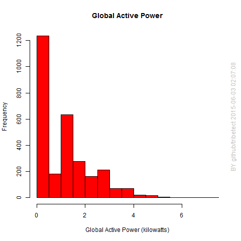
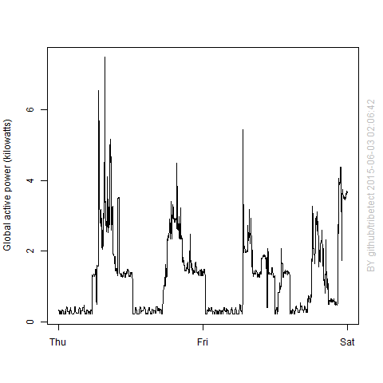
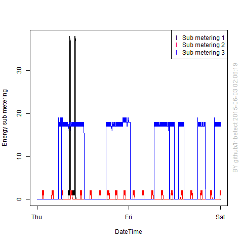
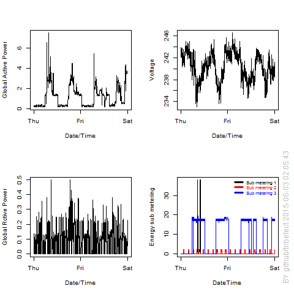

## Quick Start

This assignment uses  "Individual household electric power consumption Data Set"  from
the <a href="http://archive.ics.uci.edu/ml/">UC Irvine Machine Learning Repository</a> which I have made available for download on the course web site:
* <b>Dataset</b>: <a href="https://d396qusza40orc.cloudfront.net/exdata%2Fdata%2Fhousehold_power_consumption.zip">Electric power consumption</a> [20Mb]
* <b>Setup:</b>: To generate the four plots, the unzipped data file should found in the working directory. 
* <b>Run scripts:</b>: To generate the four plots, source the R scripts: 
* [plot1.R](plot1.R) [plot1.R](plot1.R) [plot2.R](plot2.R) [plot3.R](plot3.R) [plot4.R](plot4.R)

## Codebook
The following descriptions of the 9 variables in the dataset are taken
from
the <a href="https://archive.ics.uci.edu/ml/datasets/Individual+household+electric+power+consumption">UCI
web site</a>:

<ol>
<li><b>Date</b>: Date in format dd/mm/yyyy </li>
<li><b>Time</b>: time in format hh:mm:ss </li>
<li><b>Global_active_power</b>: household global minute-averaged active power (in kilowatt) </li>
<li><b>Global_reactive_power</b>: household global minute-averaged reactive power (in kilowatt) </li>
<li><b>Voltage</b>: minute-averaged voltage (in volt) </li>
<li><b>Global_intensity</b>: household global minute-averaged current intensity (in ampere) </li>
<li><b>Sub_metering_1</b>: energy sub-metering No. 1 (in watt-hour of active energy). It corresponds to the kitchen, containing mainly a dishwasher, an oven and a microwave (hot plates are not electric but gas powered). </li>
<li><b>Sub_metering_2</b>: energy sub-metering No. 2 (in watt-hour of active energy). It corresponds to the laundry room, containing a washing-machine, a tumble-drier, a refrigerator and a light. </li>
<li><b>Sub_metering_3</b>: energy sub-metering No. 3 (in watt-hour of active energy). It corresponds to an electric water-heater and an air-conditioner.</li>
<li><b>DateTime</b>: Added by each script, the new variable in DateTime format YYYY-MM-DD HH:MM:SS </li>

</ol>

## Analysis Method: Summary
Each script reads the data from February 1 and 2, from the year 2007. Using the base plotting system in R, the plots below are generated.

## Analysis Method: Details

###Pre-processing common to all scripts:
1. Check the working directory for unzipped data file. [Stop script if file not found. Display helpful error message.]
2. Read data from Feb 1, 2007 and Feb 2, 2007 into a data-frame
3. Convert the Date and Time variables to a new Date/Time class column, DateTime, using the `strptime()` and `as.Date()`
4. Open the PNG graphic device with dimentions 480 x 480 pixels

###Post-processing common to all scripts:
1. Close the PNG graphics device
2. Close the file connection to the data file
3. Add a watermark with a timestamp (not required)

### Making the plots

#### Plot 1
The script, [plot1.R](plot1.R) uses the function, 'hist', to construct the plot, with axis labeling, and color specification
 

#### Plot 2
The script, [plot2.R](plot2.R) uses the function, 'plot', to construct the line plot, with axis labeling, and parameter 'type' let to "l" (lower case L) to create lines connecting the data points:

 

#### Plot 3
The script, [plot3.R](plot3.R) uses the function, 'plot', followed by 'points' to add additional line plots on top with different colors. The legend command creates the box showing colors and variables in the top right.

 

#### Plot 4
The script, [plot4.R](plot4.R) uses 'par' to divide the plot area into a 2x2 area. 'plot' and 'point' build and layer the required plots. The challenge was to tweak the 'legend' command to appear correctly in the sub-metering plot.

 

